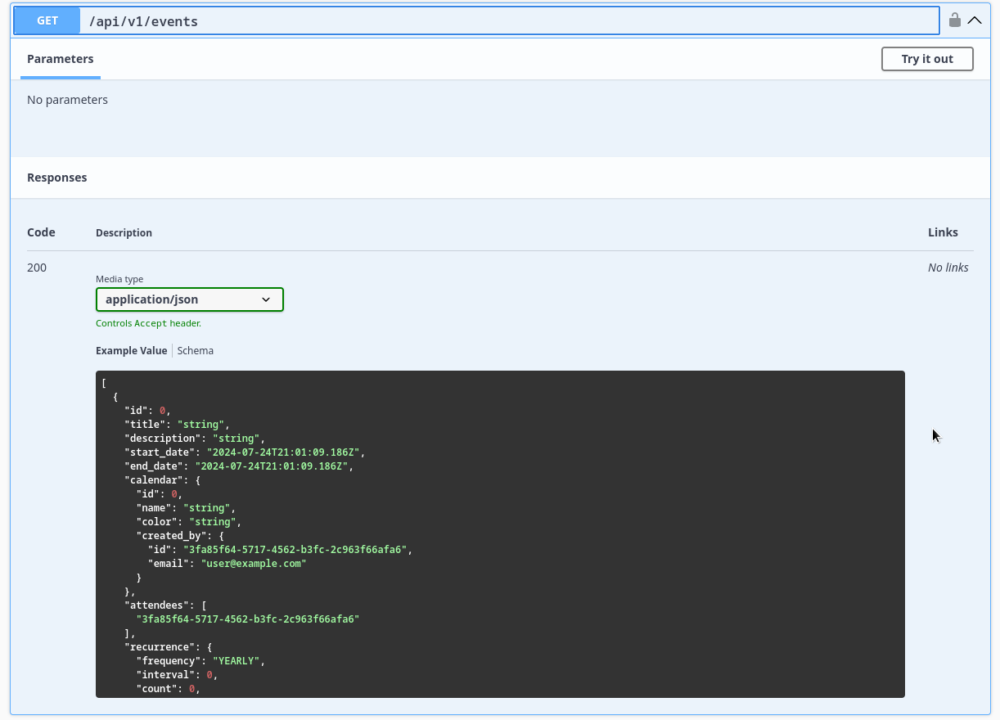

# Event

## Endpoints


## Get Request



## Post Request


# Event Occurrence

## Put Request
This endpoint allows for the updating of an occurrence.


It's worthwhile to note that the generated occurrences are generated on request and are not saved into the database.
Only when an occurrence is modified within this endpoint will it get saved and receive and object id(pk).

This does lead to the following implication


### Changing Event Occurrence Rules.
If an event is created with a recurrence rule of - 5 daily occurrences over a certain period
```json
{
  "frequency": "DAILY",
  "count": 5
}
```
If one of those occurrences is modified eg: start time is changed, that occurrence will be persisted into the database.
If the event recurrence rule is then changed to 1 once per week
```json
{
  "frequency": "WEEKLY",
  "count": 5
}
```
There is a chance that the saved occurrence date will not form part of the new recurrence rule. So the question becomes,
what happens to that occurrence? Should it be left out or included since its part of the event?

Since it is unclear when the event recurrence will change, the modified occurrence might have already taken place,
hence it would be good to keep a history of that event, thus still showing it within the results.


